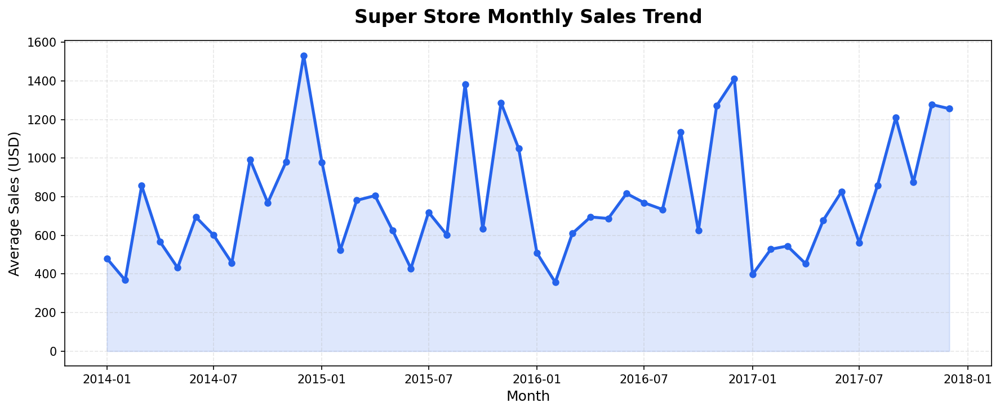
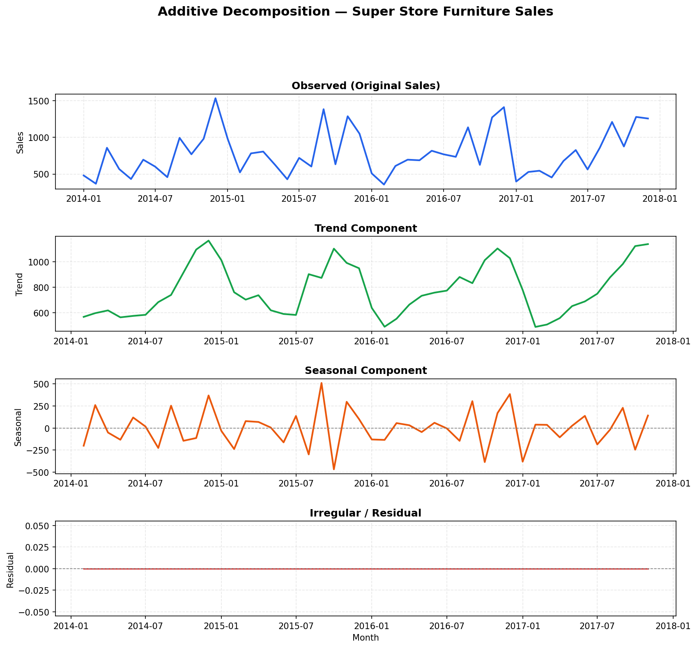

# 📊 Time Series Analysis — Super Store Sales

[Open In Colab](https://colab.research.google.com/github/kswastik453-lgtm/time-series/blob/main/10Dec_Time%20Series_Fundamentals.ipynb)

---

## 📌 About This Project

This project performs a complete **Time Series Analysis** on the **Super Store Furniture Sales dataset** — covering real retail transaction data across 4 regions of the USA.

The analysis walks through the full data science pipeline: from raw data loading and preprocessing, to monthly resampling, visual exploration, seasonal decomposition, and stationarity testing — laying the groundwork for forecasting models like **ARIMA** and **SARIMA**.

---

## 🎯 Problem Statement

> *"How do Furniture sales trend over time — and are there seasonal patterns a business can act on?"*

Retail businesses need to understand **when sales rise, when they fall, and why** — to plan inventory, staffing, and marketing budgets effectively. This project answers:

- 📈 Is there a long-term growth trend in Super Store Furniture sales?
- 🔄 Do sales follow repeating seasonal cycles each year?
- 📉 Is the data stationary and ready for ARIMA/SARIMA forecasting?

---

## 📂 Dataset Details

| Feature | Details |
|---------|---------|
| **File** | `Super_Store.csv` |
| **Total Records** | 2,121 transactions |
| **Date Range** | January 2017 — September 2017 |
| **Total Sales Value** | ₹7,41,999+ |
| **Category** | Furniture |
| **Regions Covered** | South, West, East, Central |
| **Key Columns Used** | `Order Date`, `Sales` |
| **Encoding** | Latin-1 |

---

## 🔄 Project Workflow

```
Raw Data (Super_Store.csv)
         ↓
Data Loading & Encoding (latin1)
         ↓
Feature Extraction → Order Date + Sales only
         ↓
DateTime Conversion & Sorting
         ↓
Groupby Date → Daily Sales Aggregation
         ↓
Set Date as Index
         ↓
Resample: Daily → Monthly (MS frequency)
         ↓
Line Plot Visualization
         ↓
Additive Decomposition
(Trend + Seasonal + Irregular)
         ↓
ADF Stationarity Test
         ↓
Ready for ARIMA / SARIMA / Exponential Smoothing
```

---

## 📊 Visualizations

### Monthly Sales Trend


### Additive Decomposition — Trend, Seasonal & Residual


---

## 📈 Key Steps Performed

### 1️⃣ Data Preprocessing
- Loaded 2,121 records with `latin1` encoding
- Extracted only `Order Date` and `Sales` columns
- Converted `Order Date` to proper `datetime` format
- Grouped and aggregated daily sales using `groupby`

### 2️⃣ Resampling (Daily → Monthly)
- Set `Order Date` as the time index
- Resampled to **Month Start (MS)** frequency
- Computed **monthly average sales** for smoother trend analysis

### 3️⃣ Time Series Decomposition
Applied **Additive Model**:
```
Y(T) = Trend + Seasonal + Irregular
```

| Component | What it shows |
|-----------|--------------|
| **Observed** | Original raw sales data |
| **Trend** | Long-term direction of sales |
| **Seasonal** | Repeating monthly/yearly patterns |
| **Irregular** | Random noise/residual after removing trend & seasonality |

### 4️⃣ Stationarity Testing — ADF Test
```python
def adf_test(data):
    res = adfuller(data)
    if res[1] > 0.05:
        print('Data is NOT stationary')  # Needs differencing
    else:
        print('Data IS stationary')      # Ready for ARIMA
```
- Used **Augmented Dickey-Fuller (ADF) Test**
- Significance level: **alpha = 0.05**
- Result guides differencing parameter `d` for ARIMA modeling

---

## 🛠️ Libraries Used

| Library | Purpose |
|---------|---------|
| `pandas` | Data loading, cleaning, groupby, resampling |
| `numpy` | Numerical operations |
| `matplotlib` | Line plots & decomposition visualization |
| `statsmodels` | Seasonal decomposition & ADF test |

---

## 🚀 How to Run

**▶️ Option 1 — Google Colab (Recommended, No Setup):**

Click the **Open in Colab** button at the top ☝️

**💻 Option 2 — Run Locally:**
```bash
git clone https://github.com/kswastik453-lgtm/time-series.git
cd time-series
pip install pandas numpy matplotlib statsmodels
jupyter notebook
```

---

## 🔮 Future Scope

- [ ] Exponential Smoothing forecasting
- [ ] ARIMA model building & tuning
- [ ] SARIMA for seasonal forecasting
- [ ] Sales prediction for next 6 months

---

## 👩‍💻 Author

**Swastik Kumari**
BCA Student | Data Science & ML Enthusiast | Imarticus Learning

- 🔗 [LinkedIn](https://www.linkedin.com/in/swastik-kumari-dev)
- 💻 [GitHub](https://github.com/kswastik453-lgtm)
- 📧 [kswastik453@gmail.com](mailto:kswastik453@gmail.com)
